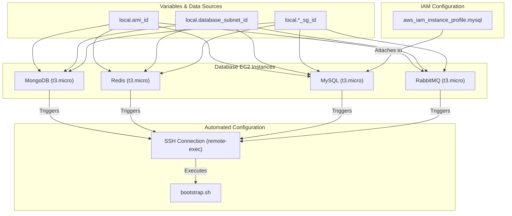

# 🗄️ 40-Databases

This layer is responsible for provisioning the stateful data storage systems required by the Roboshop application. It creates and bootstraps the backend database instances (MongoDB, Redis, MySQL, and RabbitMQ) inside the secure database subnets.

## 📋 Overview

The `40-databases` module performs the following key functions:
1. **Database Instances Provisioning**: Deploys four EC2 instances for the required databases using `t3.micro`.
2. **Secure Placement**: All databases are placed inside the private Database Subnets created in the `00-vpc` layer.
3. **Automated Bootstrapping**: Uses Terraform's `remote-exec` and `file` provisioners to copy and execute the `bootstrap.sh` script, which configures each database automatically on boot.
4. **IAM Configuration**: Creates and attaches an IAM instance profile specifically for MySQL to securely fetch credentials or parameters if needed.

## 🏗️ Architecture Visualization

The flowchart below visualizes the database provisioning flow, showing how SSM parameters (like Subnet IDs and Security Group IDs) are fetched, the instances are created, and the bootstrapping script is executed over SSH.



## 🔐 Security and Access
- **Zero Public Access**: Databases do not have public IPs and reside in private subnets.
- **Strict Security Groups**: They are associated with strict security groups created in the `10-sg` layer, with ingress rules managed in `20-sg-rules`.
- **Bootstrapping**: The initialization is done via an SSH connection using the default `ec2-user` and password, transferring the `bootstrap.sh` script dynamically.

## 🚀 Execution

To provision the databases:
```bash
cd 40-databases
terraform init
terraform apply -auto-approve
```

## Testing Databases Running Status
Commands to test MongoDB Database
```
ssh ec2-user@mongodb-dev.aitechapp.fun "netstat -lntp"  # To test network connection status
ssh ec2-user@mongodb-dev.aitechapp.fun "sudo systemctl status mongod.service" # To check running status
```
Commands to test Radis Database
```
ssh ec2-user@mongodb-dev.aitechapp.fun "netstat -lntp"  # To test network connection status
ssh ec2-user@mongodb-dev.aitechapp.fun "sudo systemctl status mongod.service" # To check running status
```
Commands to test MySQL Database
```
ssh ec2-user@mysql-dev.aitechapp.fun "netstat -lntp" # To test network connection status
ssh ec2-user@mysql-dev.aitechapp.fun "sudo systemctl status mysqld.service" # To check running status
```
Commands to test RabbitMQ Database
```
ssh ec2-user@mysql-dev.aitechapp.fun "netstat -lntp" # To test network connection status
ssh ec2-user@mysql-dev.aitechapp.fun "sudo systemctl status mysqld.service" # To check running status
```

___

## MongoDB
Below are the typical checks you can run from your local workstation to verify that the **MongoDB** instance provisioned by the `40‑databases` layer is up, listening on the expected port, and accepting client connections.

---

## 1. Verify the network socket is open

MongoDB listens on TCP port **27017** by default. Run the following command to ensure the port is open and the process is listening:

```bash
ssh ec2-user@mongodb-dev.aitechapp.fun "netstat -tlnp | grep ':27017'"
```

You should see a line similar to:

```
tcp        0      0 0.0.0.0:27017          0.0.0.0:*               LISTEN      1234/mongod
```

If nothing is returned, the MongoDB service is not listening (it may have failed to start or the security‑group inbound rule is missing).

---

## 2. Check the systemd unit

On Amazon Linux / RHEL‑based AMIs the service is called **`mongod.service`**. Use `sudo` because querying units requires root privileges.

```bash
ssh ec2-user@mongodb-dev.aitechapp.fun "sudo systemctl status mongod.service"
```

Typical successful output:

```
● mongod.service - MongoDB Database Server
    Loaded: loaded (/usr/lib/systemd/system/mongod.service; enabled; vendor preset: disabled)
    Active: active (running) since Mon 2026-04-22 14:12:03 UTC; 2 days ago
 Main PID: 2345 (mongod)
     Tasks: 22 (limit: 1152)
    Memory: 120.5M
    CGroup: /system.slice/mongod.service
```

If the unit name is not found, try the alternative:

```bash
ssh ec2-user@mongodb-dev.aitechapp.fun "sudo systemctl status mongodb.service"
```

---

## 3. Use the Mongo shell to ping the server

The `mongo` client can be used to issue a simple ping command. It returns `{ ok: 1 }` when the server is reachable.

```bash
ssh ec2-user@mongodb-dev.aitechapp.fun "mongo --eval 'db.runCommand({ping:1})'"
```

Expected output contains:

```
{ "ok" : 1 }
```

If you prefer a quick connection test without the full shell, you can also use `mongosh` if installed:

```bash
ssh ec2-user@mongodb-dev.aitechapp.fun "mongosh --eval 'db.runCommand({ping:1})'"
```

---

## 4. Common troubleshooting steps

| Symptom | Likely cause | Fix |
|---------|---------------|-----|
| `systemctl status mongod.service` → “Unit mongod.service could not be found.” | MongoDB not installed or wrong service name. | Install MongoDB: <br>`sudo yum install -y mongodb-org` (Amazon Linux) <br>Then enable/start: <br>`sudo systemctl enable --now mongod.service` |
| No listening socket on port 27017 | Service stopped or firewall blocks the port. | Start the service (`sudo systemctl start mongod.service`) and ensure the security group attached to the MongoDB EC2 instance allows inbound TCP 27017 from your bastion/your IP. |
| `mongo --eval` hangs or cannot connect | Network connectivity blocked or MongoDB bound to localhost only. | Verify the bind address in `/etc/mongod.conf` includes `0.0.0.0` or the instance's private IP. Adjust and restart the service. |
| `mongo` command not found | MongoDB client not installed. | Install the client: `sudo yum install -y mongodb-org-shell` (or the full `mongodb-org` package). |

---

## 5. One‑liner health‑check

If you just want a single command that reports the three most useful pieces of information (socket, service status, and ping), run:

```bash
ssh ec2-user@mongodb-dev.aitechapp.fun <<'EOF'
echo "=== Listening sockets ==="
netstat -tlnp | grep ':27017' || echo "No listener on 27017"
echo "=== systemd status ==="
sudo systemctl is-active mongod.service && sudo systemctl status mongod.service | head -n 10
echo "=== mongo ping ==="
mongo --eval 'db.runCommand({ping:1})' || echo "mongo client not available or cannot connect"
EOF
```

The output will quickly tell you whether MongoDB is up, listening, and healthy.

### TL;DR

1. **Port check** – `netstat -tlnp | grep ':27017'`  
2. **Service check** – `sudo systemctl status mongod.service` (or `mongodb.service`)  
3. **Ping via client** – `mongo --eval 'db.runCommand({ping:1})'` (expect `{ ok: 1 }`)  
4. **Optional** – Verify bind address in MongoDB config if connection issues persist.

## Redis
Below are the typical checks you can run from your local workstation to verify that the **Redis** instance created by the `40‑databases` layer is up, listening on the expected port, and accepting client connections.

---

## 1. Verify the network socket is open  

```bash
ssh ec2-user@redis-dev.aitechapp.fun "netstat -tlnp | grep ':6379'"
```

* `:6379` is the default Redis port.  
* You should see a line similar to:  

```
tcp        0      0 0.0.0.0:6379          0.0.0.0:*               LISTEN      1234/redis-server
```

If nothing is returned, the Redis process is not listening (it may have failed to start or the security‑group inbound rule is missing).

---

## 2. Check the systemd unit  

On Amazon Linux / RHEL‑based AMIs the service is called **`redis.service`** (or `redis-server.service` on some repos). Use `sudo` because querying units requires root privileges.

```bash
ssh ec2-user@redis-dev.aitechapp.fun "sudo systemctl status redis.service"
```

Typical successful output:

```
● redis.service - Redis In-Memory Data Store
   Loaded: loaded (/usr/lib/systemd/system/redis.service; enabled; vendor preset: disabled)
   Active: active (running) since Mon 2026-04-22 14:12:03 UTC; 2 days ago
 Main PID: 1245 (redis-server)
    Tasks: 4 (limit: 1152)
   Memory: 5.2M
   CGroup: /system.slice/redis.service
```

If the unit name is not found, try the alternative:

```bash
ssh ec2-user@redis-dev.aitechapp.fun "sudo systemctl status redis-server.service"
```

---

## 3. Use the Redis CLI to ping the server  

The `redis-cli` tool is installed together with the Redis package. A simple `PING` confirms that the server accepts client connections.

```bash
ssh ec2-user@redis-dev.aitechapp.fun "redis-cli PING"
```

Expected reply:

```
PONG
```

You can also run a quick `INFO` command to see runtime statistics:

```bash
ssh ec2-user@redis-dev.aitechapp.fun "redis-cli INFO"
```

---

## 4. Common troubleshooting steps  

| Symptom | Likely cause | Fix |
|---------|---------------|-----|
| `systemctl status redis.service` → “Unit redis.service could not be found.” | Wrong service name or Redis not installed. | Install Redis: <br>`sudo yum install -y redis` (Amazon Linux) <br>Then enable/start: <br>`sudo systemctl enable --now redis.service` |
| No listening socket on port 6379 | Service stopped or firewall blocks the port. | Start the service (`sudo systemctl start redis.service`) and ensure the security group attached to the Redis EC2 instance allows inbound TCP 6379 from your bastion/your IP. |
| `redis-cli PING` hangs or returns error | Network connectivity blocked. | Verify the security‑group inbound rule and that the instance is reachable (use `ping` or `nc -zv <host> 6379`). |
| `redis-cli` command not found | Redis client not installed. | Install the client: `sudo yum install -y redis` (the package includes both server and client). |

---

## 5. One‑liner for quick health‑check  

If you just want a single command that reports the three most useful pieces of information (socket, service status, and ping), run:

```bash
ssh ec2-user@redis-dev.aitechapp.fun <<'EOF'
echo "=== Listening sockets ==="
netstat -tlnp | grep ':6379' || echo "No listener on 6379"
echo "=== systemd status ==="
sudo systemctl is-active redis.service && sudo systemctl status redis.service | head -n 10
echo "=== redis-cli ping ==="
redis-cli PING || echo "redis-cli not available"
EOF
```

The output will quickly tell you whether Redis is up and reachable.

---

### TL;DR

1. **Check the port** – `netstat -tlnp | grep 6379`  
2. **Check the unit** – `sudo systemctl status redis.service` (or `redis-server.service`)  
3. **Ping via client** – `redis-cli PING` (expect `PONG`)  

## RabbitMQ
Below are the **quick‑check commands** you can run from your local workstation to verify that the **RabbitMQ** instance provisioned by the `40‑databases` layer is up, listening on the expected ports, and accepting client connections.

---

## 1. Verify the network sockets are open  

RabbitMQ uses two main ports by default:

| Port | Purpose |
|------|---------|
| **5672** | AMQP protocol (client connections) |
| **15672** | Management UI (optional, if the plugin is enabled) |

```bash
# Check AMQP port
ssh ec2-user@rabbitmq-dev.aitechapp.fun "netstat -tlnp | grep ':5672'"

# Check Management UI port (if enabled)
ssh ec2-user@rabbitmq-dev.aitechapp.fun "netstat -tlnp | grep ':15672'"
```

You should see lines similar to:

```
tcp        0      0 0.0.0.0:5672          0.0.0.0:*               LISTEN      2345/beam.smp
tcp        0      0 0.0.0.0:15672         0.0.0.0:*               LISTEN      2345/beam.smp
```

If nothing is returned, the RabbitMQ process is not listening (service may be stopped or the security‑group inbound rule is missing).

---

## 2. Check the systemd unit  

On Amazon Linux / RHEL‑based AMIs the service is called **`rabbitmq-server.service`**.

```bash
ssh ec2-user@rabbitmq-dev.aitechapp.fun "sudo systemctl status rabbitmq-server.service"
```

Typical successful output:

```
● rabbitmq-server.service - RabbitMQ broker
   Loaded: loaded (/usr/lib/systemd/system/rabbitmq-server.service; enabled; vendor preset: disabled)
   Active: active (running) since Mon 2026-04-22 14:12:03 UTC; 2 days ago
 Main PID: 2345 (beam.smp)
    Tasks: 45 (limit: 1152)
   Memory: 78.3M
   CGroup: /system.slice/rabbitmq-server.service
```

If the unit name is not found, try the generic name:

```bash
ssh ec2-user@rabbitmq-dev.aitechapp.fun "sudo systemctl status rabbitmq.service"
```

---

## 3. Use RabbitMQ’s CLI to query the node  

`rabbitmqctl` is installed with the server package and provides detailed health information.

```bash
# Basic status (shows running, listeners, memory, etc.)
ssh ec2-user@rabbitmq-dev.aitechapp.fun "sudo rabbitmqctl status"
```

You should see a multi‑line output ending with something like:

```
{pid,2345},
{running_applications,
    [{rabbit,"RabbitMQ","3.12.0"},
     {os_mon,"CPO  CXC 138 46","2.4.8"},
     ...]},
{listeners,[{clustering,25672,"0.0.0.0"},
           {amqp,5672,"0.0.0.0"},
           {management,15672,"0.0.0.0"}]},
...
```

If `rabbitmqctl` reports *“node not running”* or cannot connect, the broker is not started.

---

## 4. Verify the Management UI (optional)

If you enabled the management plugin during bootstrapping, you can test the HTTP endpoint:

```bash
ssh ec2-user@rabbitmq-dev.aitechapp.fun "curl -I http://localhost:15672/api/overview"
```

A `200 OK` response (or a JSON payload) indicates the UI API is reachable. You can also open a browser to `http://rabbitmq-dev.aitechapp.fun:15672` (ensure the security group allows inbound TCP 15672 from your IP).

---

## 5. Common troubleshooting checklist  

| Symptom | Likely cause | Fix |
|---------|---------------|-----|
| `systemctl status rabbitmq-server.service` → “Unit … could not be found.” | RabbitMQ not installed or wrong service name. | Install: `sudo yum install -y rabbitmq-server` (Amazon Linux) then `sudo systemctl enable --now rabbitmq-server.service`. |
| No listener on port 5672 (or 15672) | Service stopped or security‑group inbound rule missing. | Start service: `sudo systemctl start rabbitmq-server.service`. Add inbound rule for TCP 5672 (and 15672 if UI needed) to the SG attached to the instance. |
| `rabbitmqctl status` hangs or says *“node not running”* | Broker failed to start (missing Erlang, config error). | Check journal: `sudo journalctl -u rabbitmq-server.service -n 50`. Ensure Erlang runtime is present (`sudo yum install -y erlang`). |
| `curl` to port 15672 returns connection refused | Management plugin not enabled. | Enable it: `sudo rabbitmq-plugins enable rabbitmq_management` then restart: `sudo systemctl restart rabbitmq-server.service`. |
| `redis-cli`‑style commands not found (e.g., `rabbitmqctl`) | Client tools not installed. | Install the server package (it includes the CLI) or `sudo yum install -y rabbitmq-server`. |

---

## 6. One‑liner health‑check  

If you just want a single command that reports the most useful information (socket, service status, and CLI status), run:

```bash
ssh ec2-user@rabbitmq-dev.aitechapp.fun <<'EOF'
echo "=== Listening sockets (5672,15672) ==="
netstat -tlnp | grep -E ':5672|:15672' || echo "No listeners"
echo "=== systemd status ==="
sudo systemctl is-active rabbitmq-server.service && sudo systemctl status rabbitmq-server.service | head -n 12
echo "=== rabbitmqctl status ==="
sudo rabbitmqctl status || echo "rabbitmqctl not available or node down"
EOF
```

The output will quickly tell you whether RabbitMQ is up, listening, and healthy.

---

### TL;DR

1. **Port check** – `netstat -tlnp | grep ':5672'` (and `:15672` if UI).  
2. **Service check** – `sudo systemctl status rabbitmq-server.service`.  
3. **CLI health** – `sudo rabbitmqctl status` (expect a detailed status block).  
4. **Optional UI** – `curl -I http://localhost:15672/api/overview` or open the browser.

## MySQL
Below are the typical checks you can run from your local workstation to verify that the **MySQL** instance provisioned by the `40‑databases` layer is up, listening on the expected port, and accepting client connections.

---

## 1. Verify the network socket is open

MySQL listens on TCP port **3306** by default. Run the following command to ensure the port is open and the process is listening:

```bash
ssh ec2-user@mysql-dev.aitechapp.fun "netstat -tlnp | grep ':3306'"
```

You should see a line similar to:

```
tcp        0      0 0.0.0.0:3306          0.0.0.0:*               LISTEN      1234/mysqld
```

If nothing is returned, the MySQL service is not listening (it may have failed to start or the security‑group inbound rule is missing).

---

## 2. Check the systemd unit

On Amazon Linux / RHEL‑based AMIs the service is called **`mysqld.service`** (some distributions use `mysql.service`). Use `sudo` because querying units requires root privileges.

```bash
ssh ec2-user@mysql-dev.aitechapp.fun "sudo systemctl status mysqld.service"
```

Typical successful output:

```
● mysqld.service - MySQL Server
    Loaded: loaded (/usr/lib/systemd/system/mysqld.service; enabled; vendor preset: disabled)
    Active: active (running) since Mon 2026-04-22 14:12:03 UTC; 2 days ago
 Main PID: 2345 (mysqld)
     Tasks: 27 (limit: 1152)
    Memory: 150.3M
    CGroup: /system.slice/mysqld.service
```

If the unit name is not found, try the alternative:

```bash
ssh ec2-user@mysql-dev.aitechapp.fun "sudo systemctl status mysql.service"
```

---

## 3. Use the MySQL client to ping the server

The `mysqladmin` utility provides a quick health check. It returns `mysqld is alive` when the server is reachable.

```bash
ssh ec2-user@mysql-dev.aitechapp.fun "mysqladmin ping -u root -p'${MYSQL_ROOT_PASSWORD}'"
```

If you prefer the interactive client, a simple query also works:

```bash
ssh ec2-user@mysql-dev.aitechapp.fun "mysql -u root -p'${MYSQL_ROOT_PASSWORD}' -e 'SELECT 1;'"
```

Both commands should return a success message without errors.

---

## 4. Common troubleshooting steps

| Symptom | Likely cause | Fix |
|---------|---------------|-----|
| `systemctl status mysqld.service` → “Unit mysqld.service could not be found.” | MySQL not installed or wrong service name. | Install MySQL: <br>`sudo yum install -y mysql-server` (Amazon Linux) <br>Then enable/start: <br>`sudo systemctl enable --now mysqld.service` |
| No listening socket on port 3306 | Service stopped or firewall blocks the port. | Start the service (`sudo systemctl start mysqld.service`) and ensure the security group attached to the MySQL EC2 instance allows inbound TCP 3306 from your bastion/your IP. |
| `mysqladmin ping` returns `mysqld is alive` timeout or error | Network connectivity blocked or MySQL bound to localhost only. | Verify the bind address in `/etc/my.cnf` (or `/etc/mysql/mysql.conf.d/mysqld.cnf`) includes `0.0.0.0` or the instance's private IP. Adjust and restart the service. |
| `mysql` command not found | MySQL client not installed. | Install the client: `sudo yum install -y mysql` (or `mariadb-client` depending on the distro). |

---

## 5. One‑liner health‑check

If you just want a single command that reports the three most useful pieces of information (socket, service status, and ping), run:

```bash
ssh ec2-user@mysql-dev.aitechapp.fun <<'EOF'
echo "=== Listening sockets ==="
netstat -tlnp | grep ':3306' || echo "No listener on 3306"
echo "=== systemd status ==="
sudo systemctl is-active mysqld.service && sudo systemctl status mysqld.service | head -n 10
echo "=== mysqladmin ping ==="
mysqladmin ping -u root -p'${MYSQL_ROOT_PASSWORD}' || echo "mysqladmin not available or cannot connect"
EOF
```

The output will quickly tell you whether MySQL is up, listening, and healthy.

### TL;DR

1. **Port check** – `netstat -tlnp | grep ':3306'`  
2. **Service check** – `sudo systemctl status mysqld.service` (or `mysql.service`)  
3. **Ping via client** – `mysqladmin ping` or `mysql -e 'SELECT 1;'` (expect success)  
4. **Optional** – Verify bind address in MySQL config if connection issues persist.

If any step fails, install/start RabbitMQ and ensure the security‑group attached to the instance allows inbound TCP 5672 (and 15672 if you need the UI).
