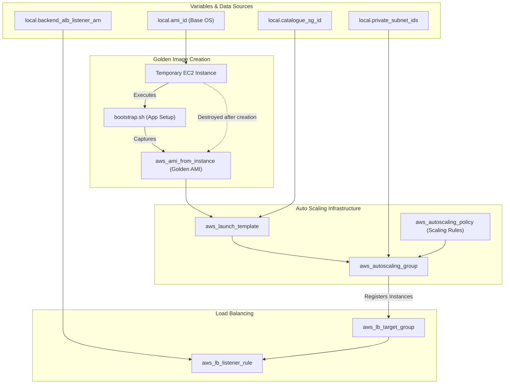

# 🏷️ 60-Catalogue

This layer is responsible for deploying the **Catalogue** microservice for the Roboshop application. It demonstrates an advanced, highly available, and auto-scaling infrastructure pattern using AWS Auto Scaling Groups (ASG), Launch Templates, and Application Load Balancer integration.

## 📋 Overview

The `60-catalogue` module performs the following critical functions:
1. **AMI Baking (Golden Image)**: Provisions a temporary EC2 instance, bootstraps the catalogue application using `bootstrap.sh`, and captures it as a custom Amazon Machine Image (AMI). The temporary instance is then destroyed.
2. **Launch Template**: Creates an AWS Launch Template using the generated Golden Image, ensuring that all future instances spin up fully configured.
3. **Auto Scaling Group (ASG)**: Deploys an ASG in the private subnets. The ASG manages the desired capacity, scaling out or in based on configured policies (e.g., CPU utilization).
4. **Load Balancer Integration**: Creates a Target Group and a Listener Rule to attach the Catalogue ASG instances to the Backend ALB created in the `50-backend-alb` layer, routing traffic based on the `catalogue` path or header.

## 🏗️ Architecture Visualization

The flowchart below visualizes the lifecycle of the Catalogue deployment, from Golden Image creation to Auto Scaling integration.



## 🔐 Security and Access
- **Private Subnet Placement**: All Catalogue instances spawned by the ASG are isolated within the private subnets.
- **Dynamic Port Mapping**: Instances only accept traffic from the Backend ALB security group, ensuring they cannot be bypassed.

## 🚀 Execution

To provision the Catalogue service:
```bash
cd 60-catalogue
terraform init
terraform apply -auto-approve
```

---

## Troubleshooting / Quick‑Check Commands

The **Catalogue** service runs on EC2 instances managed by an Auto Scaling Group (ASG) and is fronted by the Backend Application Load Balancer (ALB). The following commands let you quickly verify that the service is healthy, listening on the expected port, and reachable through the load balancer.

### 1. Verify the ASG is running the desired number of instances

```bash
aws autoscaling describe-auto-scaling-groups \
    --auto-scaling-group-names $(terraform output -raw catalogue_asg_name) \
    --query 'AutoScalingGroups[0].Instances[].[InstanceId,LifecycleState,HealthStatus]' \
    --output table
```

You should see each instance listed with `InService` and `Healthy`. If any instance shows a different state, investigate the instance logs or the health checks.

### 2. Check the ALB target health for the catalogue instances

```bash
aws elbv2 describe-target-health \
    --target-group-arn $(terraform output -raw catalogue_target_group_arn) \
    --query 'TargetHealthDescriptions[*].{Id:Target.Id,State:TargetHealth.State,Reason:TargetHealth.Reason}' \
    --output table
```

All targets should report `healthy`. A `unhealthy` state usually means the instance is not responding on the health‑check port (default TCP 8080) or the security group is blocking traffic.

### 3. Verify the service is listening on the expected port (default **8080**) on an instance

Replace `<instance-id>` with one of the IDs from step 1. The instance’s public DNS is obtained via the AWS CLI:

```bash
INSTANCE_DNS=$(aws ec2 describe-instances \
    --instance-ids <instance-id> \
    --query 'Reservations[0].Instances[0].PublicDnsName' \
    --output text)

ssh ec2-user@$INSTANCE_DNS "netstat -tlnp | grep ':8080'"
```

You should see a line similar to:

```
tcp        0      0 0.0.0.0:8080          0.0.0.0:*               LISTEN      2345/java
```

If nothing is returned, the catalogue application failed to start or the port configuration is incorrect.

### 4. Check the systemd unit on the instance (if the service is managed by systemd)

```bash
ssh ec2-user@$INSTANCE_DNS "sudo systemctl status catalogue.service"
```

Typical successful output:

```
● catalogue.service - Catalogue Microservice
   Loaded: loaded (/etc/systemd/system/catalogue.service; enabled; vendor preset: disabled)
   Active: active (running) since Mon 2026-04-22 14:12:03 UTC; 2 days ago
 Main PID: 3456 (java)
    Tasks: 45 (limit: 1152)
   Memory: 250.1M
   CGroup: /system.slice/catalogue.service
```

If the unit name differs, adjust the command accordingly (e.g., `catalogue-app.service`).

### 5. End‑to‑end health check via the ALB DNS name

The Backend ALB DNS can be obtained from Terraform output:

```bash
ALB_DNS=$(terraform output -raw backend_alb_dns_name)
curl -s -o /dev/null -w "%{http_code}\n" http://$ALB_DNS/catalogue/health
```

The command should return `200`. A different status code indicates the health endpoint is not reachable or the service is not responding.

---

## TL;DR

1. **ASG instances** – `aws autoscaling describe-auto-scaling-groups …` – all `InService`/`Healthy`.
2. **ALB target health** – `aws elbv2 describe-target-health …` – all `healthy`.
3. **Port check** – `netstat -tlnp | grep ':8080'` on an instance.
4. **Systemd status** – `sudo systemctl status catalogue.service` on the instance.
5. **End‑to‑end** – `curl http://<alb-dns>/catalogue/health` – expect `200`.
