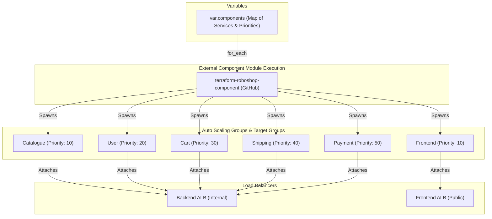
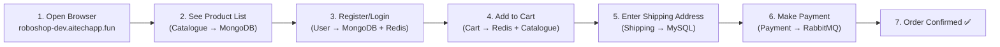
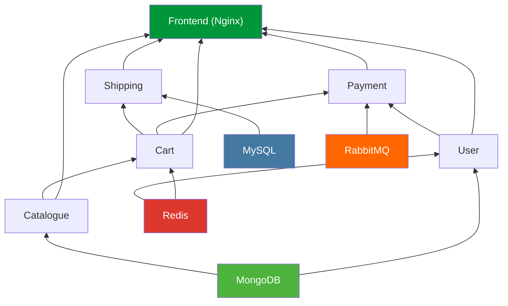

# 🧩 90-Components

This layer provisions the remaining **Microservices** (Catalogue, User, Cart, Shipping, Payment, and Frontend) for the Roboshop application. Instead of duplicating Terraform code for each microservice, this layer uses a dynamic `for_each` loop over an external shared module.

## 📋 Overview

The `90-components` module performs the following functions:
1. **Batch Microservice Provisioning**: Uses the `terraform-roboshop-component` module to provision multiple identical components efficiently.
2. **Dynamic Routing Setup**: Passes unique routing priorities for each component (e.g., `catalogue = 10`, `user = 20`) so that the Load Balancers know how to correctly route traffic paths to the correct Auto Scaling Groups.
3. **Frontend and Backend Separation**: The module handles both Backend components (which attach to the Backend ALB) and the Frontend component (which attaches to the Frontend ALB).

## 🏗️ Architecture Visualization

The flowchart below demonstrates how the single module dynamically provisions multiple distinct microservices and links them to the correct Load Balancer rules based on the provided variables.



## 🔐 Security and Access
- **Encapsulation**: Because it relies on the central module, all subnets and security group IDs are inherently configured correctly without duplicating manual inputs.
- **Rule Priorities**: Ensures that ALB Listener rules do not conflict. AWS ALBs process listener rules in order of priority, so ensuring no two services have the same priority is strictly enforced here.

## 🚀 Execution

To provision the microservices:
```bash
cd 90-components
terraform init
terraform apply -auto-approve
```

---

## 🧪 Debugging & Testing Guide

After deploying `90-components`, use this section to verify every component is healthy and working correctly.

### 📌 Component Quick Reference

| # | Component | Language | Port | ALB | Host Header (Listener Rule) | Database Dependency |
|---|-----------|----------|------|-----|----------------------------|---------------------|
| 1 | **Catalogue** | Node.js | 8080 | Backend (Internal) | `catalogue.backend-alb-dev.aitechapp.fun` | MongoDB |
| 2 | **User** | Node.js | 8080 | Backend (Internal) | `user.backend-alb-dev.aitechapp.fun` | MongoDB + Redis |
| 3 | **Cart** | Node.js | 8080 | Backend (Internal) | `cart.backend-alb-dev.aitechapp.fun` | Redis + Catalogue |
| 4 | **Shipping** | Java | 8080 | Backend (Internal) | `shipping.backend-alb-dev.aitechapp.fun` | MySQL + Cart |
| 5 | **Payment** | Python | 8080 | Backend (Internal) | `payment.backend-alb-dev.aitechapp.fun` | RabbitMQ + Cart + User |
| 6 | **Frontend** | Nginx | 80 | Frontend (Public) | `frontend-dev.aitechapp.fun` | All backend services |

---

### 🌐 1. Frontend Testing

The Frontend is the **only public-facing** component. Test it from your browser or terminal.

#### Browser Test
Open your browser and go to:
```
https://frontend-dev.aitechapp.fun
```
> **Expected**: Roboshop e-commerce UI ("Stan's Robot Shop") should load with product listings, navigation bar, search box, and robot images.

> **Note**: This URL comes from the `90-components` module which generates the host header as `frontend-dev.aitechapp.fun` (from `locals.tf`: `${var.component}-${var.environment}.${var.domain_name}`). The `80-frontend-alb` layer has a separate rule for `roboshop-dev.aitechapp.fun`, but the actual working app is served via `frontend-dev.aitechapp.fun`.

#### Health Check
```bash
curl https://frontend-dev.aitechapp.fun/health
```
**Expected Output** (Nginx stub status):
```
Active connections: 1
server accepts handled requests
 10 10 5
Reading: 0 Writing: 1 Waiting: 0
```

#### Failure Indicators
| Symptom | Likely Cause | Fix |
|---------|-------------|-----|
| `<h1>Hi, I am from HTTPS Frontend ALB</h1>` | Listener rule not matching your host header | Check host header in listener rule vs URL you're accessing |
| `502 Bad Gateway` | Frontend instance unhealthy / ASG not launched | Check Target Group health in AWS Console |
| Page loads but no products | Catalogue backend is down | Test catalogue first (see below) |
| Page loads but login fails | User backend is down | Test user service (see below) |
| Images not loading | CDN (95-cdn) not configured or static files missing | Check CloudFront distribution |

---

### 🔌 2. Backend Component Testing (via Bastion)

Backend components are on **private subnets** behind the **internal ALB**. You cannot access them directly from the internet. You must SSH into the Bastion host (or connect via OpenVPN) to test them.

#### Connect to Bastion
```bash
# Via OpenVPN (if 98-openvpn is deployed)
# Or via direct SSH
ssh -i <key_file> ec2-user@<bastion-public-ip>
```

---

### 📦 2a. Catalogue Service

**What it does**: Serves the product catalog from MongoDB.

#### Health Check
```bash
curl http://catalogue.backend-alb-dev.aitechapp.fun/health
```
**Expected Output**:
```json
{"app":"OK","mongo":true}
```

#### Functional Test — List Products
```bash
curl http://catalogue.backend-alb-dev.aitechapp.fun/products | jq '.' | head -20
```
**Expected**: JSON array of products with fields like `name`, `description`, `price`, `image_url`.

#### Functional Test — Get Product Count
```bash
curl http://catalogue.backend-alb-dev.aitechapp.fun/count
```
**Expected**: Returns a number (e.g., `9` products).

#### Functional Test — Get Categories
```bash
curl http://catalogue.backend-alb-dev.aitechapp.fun/categories | jq '.'
```
**Expected**: JSON array of product categories.

#### Failure Scenarios
| Symptom | Likely Cause | Debug Command |
|---------|-------------|---------------|
| `{"app":"OK","mongo":false}` | MongoDB connection failed | `mongosh --host mongodb-dev.aitechapp.fun --eval 'db.runCommand({ping:1})'` |
| `Connection refused` | Catalogue service not running | SSH into instance → `systemctl status catalogue` |
| `<h1>Hi, I am from HTTP Backend ALB</h1>` | Listener rule not matching | Check `catalogue` rule in Backend ALB listeners |
| Empty product list `[]` | MongoDB data not loaded | `mongosh --host mongodb-dev.aitechapp.fun --eval 'db.getMongo().getDBNames()'` |

---

### 👤 2b. User Service

**What it does**: Handles user registration, login, and session management using MongoDB and Redis.

#### Health Check
```bash
curl http://user.backend-alb-dev.aitechapp.fun/health
```
**Expected Output**:
```json
{"app":"OK","mongo":true}
```

#### Functional Test — User Login
```bash
curl -X POST http://user.backend-alb-dev.aitechapp.fun/login \
  -H "Content-Type: application/json" \
  -d '{"email":"test@example.com","password":"test123"}'
```
**Expected**: JSON response with user token or error if user doesn't exist.

#### Failure Scenarios
| Symptom | Likely Cause | Debug Command |
|---------|-------------|---------------|
| `{"app":"OK","mongo":false}` | MongoDB unreachable | `mongosh --host mongodb-dev.aitechapp.fun --eval 'db.runCommand({ping:1})'` |
| Login works but sessions expire instantly | Redis connection failed | `redis-cli -h redis-dev.aitechapp.fun ping` (Expected: `PONG`) |
| `Connection refused` | User service not running | SSH into instance → `systemctl status user` |

---

### 🛒 2c. Cart Service

**What it does**: Manages shopping cart operations. Depends on Redis (session storage) and Catalogue (product info).

#### Health Check
```bash
curl http://cart.backend-alb-dev.aitechapp.fun/health
```
**Expected Output**:
```json
{"app":"OK"}
```

#### Functional Test — Get Cart (by user ID)
```bash
curl http://cart.backend-alb-dev.aitechapp.fun/cart/test-user-id | jq '.'
```
**Expected**: JSON object with cart items (empty `{}` if no items).

#### Failure Scenarios
| Symptom | Likely Cause | Debug Command |
|---------|-------------|---------------|
| Cannot add to cart | Redis connection failed | `redis-cli -h redis-dev.aitechapp.fun ping` |
| Cart shows but no product details | Catalogue service is down | Test catalogue health (see above) |
| `Connection refused` | Cart service not running | SSH into instance → `systemctl status cart` |

---

### 🚚 2d. Shipping Service

**What it does**: Calculates shipping charges. Uses MySQL for city/distance data and depends on Cart service.

#### Health Check
```bash
curl http://shipping.backend-alb-dev.aitechapp.fun/health
```
**Expected Output**:
```json
{"app":"OK"}
```

#### Functional Test — Get Shipping Cities
```bash
curl http://shipping.backend-alb-dev.aitechapp.fun/cities | jq '.' | head -20
```
**Expected**: JSON array of city objects with `id`, `city`, `state`, `country` fields.

#### Functional Test — Calculate Shipping
```bash
curl http://shipping.backend-alb-dev.aitechapp.fun/calc \
  -H "Content-Type: application/json" \
  -d '{"city":"Hyderabad"}'
```
**Expected**: JSON with shipping cost.

#### Failure Scenarios
| Symptom | Likely Cause | Debug Command |
|---------|-------------|---------------|
| `Access denied for user 'root'` | MySQL password mismatch | Check `login_password` in `shipping/tasks/main.yaml` matches SSM parameter |
| `/root/.my.cnf` not found | Same as above (password fallback error) | `aws ssm get-parameter --name /roboshop/dev/mysql_root_password --with-decryption --query Parameter.Value --output text` |
| Empty cities list | MySQL schema not imported | SSH → `mysql -h mysql-dev.aitechapp.fun -u root -p'RoboShop@123' -e 'USE cities; SELECT count(*) FROM cities;'` |
| `Connection refused` | Shipping service not running | SSH into instance → `systemctl status shipping` |
| Java errors in logs | JDK not installed properly | SSH → `java -version` and check `/app/shipping.jar` exists |

---

### 💳 2e. Payment Service

**What it does**: Processes payments. Sends order confirmations to RabbitMQ. Depends on Cart, User, and RabbitMQ.

#### Health Check
```bash
curl http://payment.backend-alb-dev.aitechapp.fun/health
```
**Expected Output**:
```json
{"app":"OK"}
```

#### Failure Scenarios
| Symptom | Likely Cause | Debug Command |
|---------|-------------|---------------|
| `Connection refused` on RabbitMQ | RabbitMQ service down or credentials wrong | SSH → `curl -u roboshop:roboshop123 http://rabbitmq-dev.aitechapp.fun:15672/api/overview` |
| Payment processes but no dispatch | RabbitMQ queue not receiving messages | Check RabbitMQ management UI (port 15672) |
| `Connection refused` | Payment service not running | SSH into instance → `systemctl status payment` |
| Python import errors | Dependencies not installed | SSH → `pip3.9 list` and check `uwsgi` is present |

---

### 🗄️ 3. Database Connectivity Testing (from Bastion)

Before testing microservices, make sure all databases deployed in `40-databases` are reachable:

```bash
# MongoDB
mongosh --host mongodb-dev.aitechapp.fun --eval 'db.runCommand({ping:1})'
# Expected: { ok: 1 }

# Redis
redis-cli -h redis-dev.aitechapp.fun ping
# Expected: PONG

# MySQL
mysql -h mysql-dev.aitechapp.fun -u root -p'RoboShop@123' -e "SELECT 1;"
# Expected: +---+  | 1 |  +---+  | 1 |  +---+

# RabbitMQ
curl -u roboshop:roboshop123 http://rabbitmq-dev.aitechapp.fun:15672/api/overview | jq '.node'
# Expected: "rabbit@ip-10-0-..."
```

---

### 🏥 4. Target Group Health Checks (AWS Console / CLI)

Each component has an Auto Scaling Group with instances registered to a Target Group. Check health status:

#### Using AWS Console
```
EC2 → Target Groups → Select "roboshop-dev-<component>" → Targets tab → Check Health Status
```

#### Using AWS CLI
```bash
# List all target groups
aws elbv2 describe-target-groups \
  --query 'TargetGroups[*].{Name:TargetGroupName,ARN:TargetGroupArn}' --output table

# Check health for a specific target group
aws elbv2 describe-target-health \
  --target-group-arn <TARGET_GROUP_ARN> \
  --query 'TargetHealthDescriptions[*].{Target:Target.Id,Port:Target.Port,Health:TargetHealth.State,Reason:TargetHealth.Reason}' \
  --output table
```

**Health Status Meanings:**

| Status | Meaning | Action Needed |
|--------|---------|--------------|
| `healthy` | Instance is passing health checks ✅ | None |
| `unhealthy` | Health check endpoint returns non-2xx | SSH into instance, check service status and logs |
| `initial` | Instance just launched, health check in progress | Wait 2 minutes (health_check_grace_period = 120s) |
| `draining` | Instance is being deregistered | Wait for deregistration (deregistration_delay = 60s) |
| `unused` | Target group has no targets | ASG may not have launched instances — check ASG desired count |

---

### 📋 5. Service Logs (SSH into Instance)

When a component is unhealthy, SSH into the instance and check logs:

```bash
# Check service status
sudo systemctl status <component>
# Example: sudo systemctl status catalogue

# View real-time logs
sudo journalctl -u <component> -f
# Example: sudo journalctl -u shipping -f

# View last 50 lines of logs
sudo journalctl -u <component> -n 50 --no-pager

# Check if the application jar/server file exists
ls -la /app/

# Check the port is listening
sudo ss -tlnp | grep <port>
# Backend services: grep 8080
# Frontend (Nginx): grep 80
```

---

### 🔄 6. End-to-End User Flow Test

Once all components are healthy, test the complete user journey:



| Step | What to Do | What to Expect | If it Fails |
|------|-----------|---------------|-------------|
| **1** | Open `https://frontend-dev.aitechapp.fun` in browser | "Stan's Robot Shop" homepage loads with product images | Check Frontend Target Group health |
| **2** | Scroll down to see products | Grid of products with names, prices, and images | Test Catalogue health endpoint |
| **3** | Click "Register" → fill form → click "Login" | Successful login, redirected to homepage | Test User health + Redis connectivity |
| **4** | Click "Add to Cart" on any product | Cart icon shows item count | Test Cart health + Redis |
| **5** | Click Cart icon → "Checkout" → enter address | Shipping cost calculated and displayed | Test Shipping health + MySQL |
| **6** | Click "Pay" | Payment confirmation message | Test Payment health + RabbitMQ |
| **7** | Check order in "My Orders" | Order listed with status | All services must be healthy |

---

### 🚨 7. Common Errors & Solutions

#### Error: `terraform apply` Partial Failure
```
Error: remote-exec provisioner error
  Process exited with status 2
```
**Cause**: Ansible playbook failed during component bootstrapping.  
**Fix**: Check which component failed → read Ansible output → fix the root cause → taint and re-apply:
```bash
terraform taint 'module.component["<component>"].terraform_data.main'
terraform apply -auto-approve
```

#### Error: Target Group Already Exists
```
Error: creating ELBv2 Target Group (roboshop-dev-xxx) already exists
```
**Cause**: Previous partial apply created the resource in AWS but didn't save it to Terraform state.  
**Fix**: Import the existing resource:
```bash
# Get the ARN
aws elbv2 describe-target-groups --names roboshop-dev-<component> --query 'TargetGroups[0].TargetGroupArn' --output text

# Import it
terraform import 'module.component["<component>"].aws_lb_target_group.main' <ARN>
terraform apply -auto-approve
```

#### Error: Listener Rule Priority In Use
```
Error: PriorityInUse: Priority 'XX' is currently in use
```
**Cause**: Same as above — rule exists in AWS but not in state.  
**Fix**: Find and import the rule:
```bash
# Get rules for the listener
aws elbv2 describe-rules --listener-arn <LISTENER_ARN> --query "Rules[?Priority=='<PRIORITY>'].RuleArn" --output text

# Import it (use listener-RULE ARN, not listener ARN!)
terraform import 'module.component["<component>"].aws_lb_listener_rule.main' <RULE_ARN>
```

> ⚠️ **Important**: Listener ARN format: `...listener/app/...`  
> Listener **Rule** ARN format: `...listener-rule/app/...` — these are different!

#### Error: AMI Already Exists
```
Error: creating EC2 AMI (roboshop-dev-xxx): the name is already in use
```
**Fix**: Deregister the old AMI from AWS Console (EC2 → AMIs → Select → Deregister), then re-apply.

#### Error: Health Check Failing (Target Unhealthy)
**Debug steps:**
1. Check if the instance exists: `aws ec2 describe-instances --filters "Name=tag:Name,Values=roboshop-dev-<component>" --query 'Reservations[*].Instances[*].{ID:InstanceId,State:State.Name,IP:PrivateIpAddress}' --output table`
2. SSH into the instance (via Bastion)
3. Check service: `systemctl status <component>`
4. Check logs: `journalctl -u <component> -n 50 --no-pager`
5. Check port: `ss -tlnp | grep 8080`

---

### 🔬 8. Quick Health Check Script

Run this from the Bastion host to test all components at once:

```bash
#!/bin/bash

echo "========================================="
echo "  Roboshop Component Health Check"
echo "========================================="

# Backend components (via Internal ALB)
for svc in catalogue user cart shipping payment; do
  echo -n "  $svc: "
  response=$(curl -s -o /dev/null -w "%{http_code}" http://$svc.backend-alb-dev.aitechapp.fun/health 2>/dev/null)
  if [ "$response" == "200" ]; then
    echo "✅ HEALTHY (HTTP $response)"
  else
    echo "❌ UNHEALTHY (HTTP $response)"
  fi
done

# Frontend (via Public ALB)
echo -n "  frontend: "
response=$(curl -s -o /dev/null -w "%{http_code}" https://frontend-dev.aitechapp.fun/health 2>/dev/null)
if [ "$response" == "200" ]; then
  echo "✅ HEALTHY (HTTP $response)"
else
  echo "❌ UNHEALTHY (HTTP $response)"
fi

echo ""
echo "========== Database Checks =============="

echo -n "  MongoDB: "
mongosh --host mongodb-dev.aitechapp.fun --quiet --eval 'db.runCommand({ping:1}).ok' 2>/dev/null && echo "✅ CONNECTED" || echo "❌ UNREACHABLE"

echo -n "  Redis: "
redis-cli -h redis-dev.aitechapp.fun ping 2>/dev/null | grep -q PONG && echo "✅ CONNECTED" || echo "❌ UNREACHABLE"

echo -n "  MySQL: "
mysql -h mysql-dev.aitechapp.fun -u root -p'RoboShop@123' -e "SELECT 1;" 2>/dev/null | grep -q 1 && echo "✅ CONNECTED" || echo "❌ UNREACHABLE"

echo -n "  RabbitMQ: "
curl -s -u roboshop:roboshop123 http://rabbitmq-dev.aitechapp.fun:15672/api/overview 2>/dev/null | grep -q node && echo "✅ CONNECTED" || echo "❌ UNREACHABLE"

echo "========================================="
```

**Expected Output (All Healthy):**
```
=========================================
  Roboshop Component Health Check
=========================================
  catalogue: ✅ HEALTHY (HTTP 200)
  user:      ✅ HEALTHY (HTTP 200)
  cart:      ✅ HEALTHY (HTTP 200)
  shipping:  ✅ HEALTHY (HTTP 200)
  payment:   ✅ HEALTHY (HTTP 200)
  frontend:  ✅ HEALTHY (HTTP 200)

========== Database Checks ==============
  MongoDB:  ✅ CONNECTED
  Redis:    ✅ CONNECTED
  MySQL:    ✅ CONNECTED
  RabbitMQ: ✅ CONNECTED
=========================================
```

---

### 🗺️ 9. Component Dependency Map

Use this to understand which service depends on what. If a downstream dependency is broken, all upstream services relying on it will also fail.



**Debugging order** (always start from the bottom — databases first):
1. MongoDB → 2. Redis → 3. MySQL → 4. RabbitMQ → 5. Catalogue → 6. User → 7. Cart → 8. Shipping → 9. Payment → 10. Frontend
